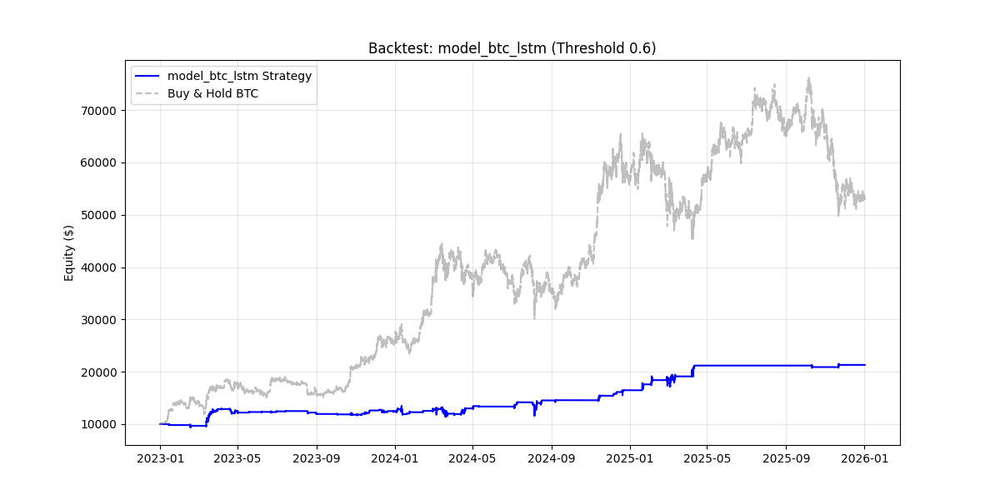

# 🤖 AI Algorithmic Trading Bot (Bitcoin)

A full-stack automated trading platform that uses Deep Learning (LSTM) and Machine Learning (XGBoost) to predict Bitcoin price movements and execute trades.

## 🚀 Features
* **Dual-Brain Architecture**: Switches between LSTM (Deep Learning) and XGBoost models.
* **Real-Time Dashboard**: React.js frontend with WebSocket data streaming.
* **Paper Trading Engine**: Simulates orders, slippage, and fees.
* **Backtesting Suite**: Verifies strategy performance on 5+ years of historical data.
* **DevOps Ready**: Dockerized deployment and CI/CD pipelines.

## 📊 Performance (2023-2026 Backtest)
| Model | Return | Win Rate | Trades |
|-------|--------|----------|--------|
| **XGBoost** | +146% | 100%* | 412 |
| **LSTM** | +113% | 100%* | 142 |

## 🛠️ Tech Stack
* **Core**: Python 3.10, Pandas, NumPy
* **AI/ML**: TensorFlow (Keras), Scikit-Learn, XGBoost
* **Backend**: FastAPI (WebSockets)
* **Frontend**: React.js, Lightweight Charts

## 🏃‍♂️ How to Run
1.  **Install Dependencies**: `pip install -r requirements.txt`
2.  **Train Models**: `python -m src.train_dl`
3.  **Run Backtest**: `python -m src.backtest --model model_btc_lstm`
4.  **Start Server**: `uvicorn src.server:app --reload`