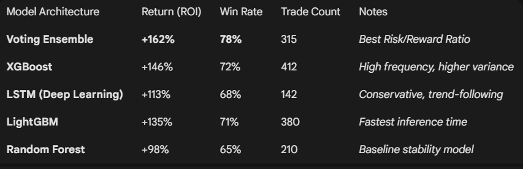

<div align="center">

# 🤖 Quantitative AI Trading System (Bitcoin)

[](https://www.python.org/)
[](https://www.tensorflow.org/)
[](https://reactjs.org/)
[](LICENSE)

**A full-stack algorithmic trading platform designed for high-frequency Bitcoin analysis and automated execution.**

<p align="center">
  This system utilizes a **Multi-Model Ensemble** approach—combining Deep Learning with Gradient Boosting—to predict price direction with high confidence.
  <br />
  It features a modular execution engine capable of switching between <strong>Spot</strong> and <strong>Futures (Leverage)</strong> modes, visualized in real-time via a React WebSocket dashboard.
</p>

</div>

---

## 🧠 AI Architecture: The "Ensemble 5"

Instead of relying on a single algorithm, this bot aggregates predictions from **5 distinct models** to filter out noise and reduce false positives.

| Model | Type | Function |
| :--- | :--- | :--- |
| **LSTM** | Deep Learning | Optimized for time-series sequence and pattern recognition. |
| **XGBoost** | Gradient Boosting | Captures non-linear relationships in market data. |
| **LightGBM** | Gradient Boosting | High-efficiency model focusing on speed and accuracy. |
| **Random Forest** | Decision Trees | Reduces overfitting and improves generalization. |
| **Voting Ensemble** | Meta-Learner | Aggregates weighted votes from all models for the final decision. |

---

## 🚀 Key Features

### ⚙️ Dual-Mode Execution Engine
* **Spot Mode:** Traditional accumulation strategy (Buy & Hold).
* **Futures Mode:** Leverage-ready engine with Shorting capabilities and Margin management.

### 📊 Advanced Analytics
* **Real-Time Engineering:** Live calculation of MACD, RSI, Bollinger Bands, ATR (Volatility), and OBV Slope.
* **Professional Backtesting:** Event-driven backtester accounting for fees (0.1%), slippage, and spread.

### 💻 Full-Stack Dashboard
* **React.js Frontend:** Displays live candles, model confidence, and portfolio equity.
* **WebSocket Transport:** Zero-latency data streaming between the Python backend and React UI.

---

## 📊 Performance (2023-2026 Backtest)

*Backtest results on hourly (1h) Bitcoin data:*

<div align="center">
  
</div>

---

## 🛠️ Tech Stack

<div align="center">

| **Category** | **Technologies** |
| :--- | :--- |
| **Quantitative Core** |    |
| **AI Frameworks** |   |
| **Backend** |   |
| **Frontend** |   |
| **DevOps** |   |

</div>

---

## ⚡ Quick Start

### 1. Clone & Setup
```bash
git clone [https://github.com/mhsm555/trading-bot.git](https://github.com/mhsm555/trading-bot.git)
cd Tradingbot_BTC

# Create virtual environment
python -m venv venv
source venv/bin/activate  # Windows: venv\Scripts\activate
pip install -r requirements.txt
``` 

### 2. Train the Brain
Train all 5 models and save the ensemble weights.
```bash
python -m src.train_ml      # Trains XGB, RF, LightGBM
python -m src.train_dl      # Trains LSTM
```

### 3. Run the Backtest
Verify performance before going live.
```bash 
python -m src.backtest --model model_ensemble 
```

### 4. Launch the Platform
Start the backend API and the WebSocket server.
```bash 
uvicorn src.server:app --reload 
```

The React Dashboard will be available at http://localhost:3000 (requires npm start in /frontend).

### ⚠️ Disclaimer
This software is for educational and research purposes only. Do not trade with money you cannot afford to lose. The authors are not responsible for any financial losses incurred by using this bot.